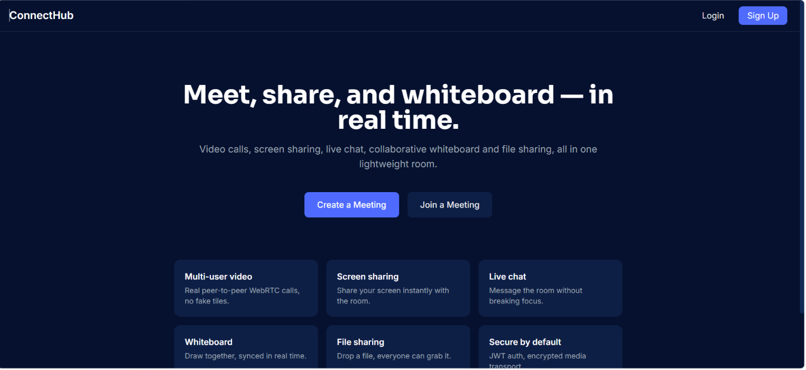
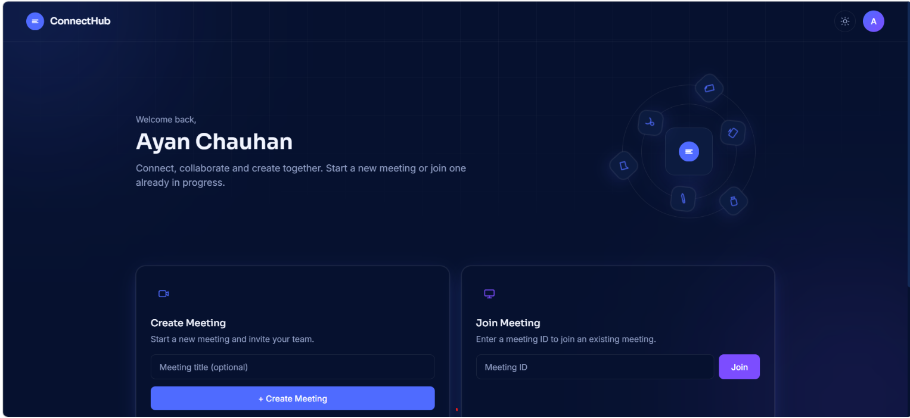
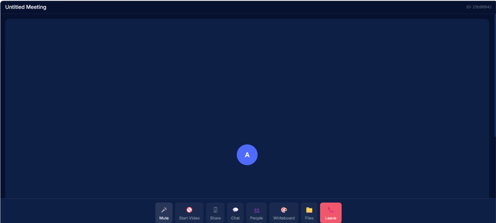
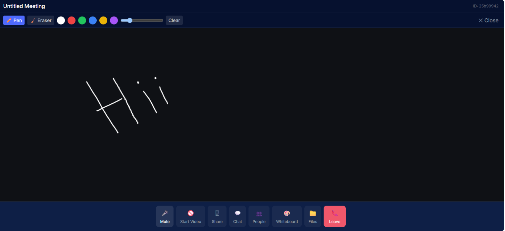

# ConnectHub — Real-Time Communication & Collaboration App

CodeAlpha Full Stack Development Internship — **Task 4**.
A working multi-user video meeting app: real WebRTC calls, screen share, live chat,
collaborative whiteboard, and file sharing, built on the MERN stack + Socket.IO.

## Live Demo

- **App:** https://codealpha-tasks-2-three.vercel.app
- **API:** https://codealpha-tasks-2-hfoj.onrender.com

Backend is on Render's free tier — it sleeps after inactivity, so the first request
after idle can take 30-60s to wake up.

## Screenshots

| Landing Page | Dashboard |
|---|---|
|  |  |

| Meeting Room | Whiteboard |
|---|---|
|  |  |

## Features

- User authentication (JWT, bcrypt password hashing)
- Create/join meetings by ID, meeting lobby with camera preview
- Real multi-user video calling — actual WebRTC peer connections, not mocked video
- Mute/unmute mic, camera on/off, join muted/camera-off
- Screen sharing via `getDisplayMedia`
- Real-time chat (Socket.IO, persisted to MongoDB)
- Collaborative whiteboard (Canvas + pointer events, synced drawing ops, late-joiner sync)
- File sharing with upload/download, size + MIME type validation
- Participant panel with host indicator, mic/cam state
- Host can end meeting; disconnect/leave cleans up peers and Socket.IO rooms

## Tech Stack

**Frontend:** React 18, Vite, TypeScript, React Router, Tailwind CSS, Axios, Socket.IO-client, native WebRTC APIs, Canvas API.

**Backend:** Node.js, Express, TypeScript, Socket.IO, JWT, bcryptjs, Mongoose, Helmet, CORS, express-rate-limit, Multer.

**Database:** MongoDB (Atlas or local).

## Architecture

```
Browser A ──WebSocket──> Socket.IO signaling server <──WebSocket── Browser B
     │                                                                 │
     └──────────────── WebRTC peer connection (media) ────────────────┘

Browser ──REST + JWT──> Express API ──Mongoose──> MongoDB
```

REST handles auth, meeting metadata, chat history, and file upload/download.
Socket.IO handles everything real-time: signaling, presence, chat delivery, whiteboard sync.
Video/audio never touches the Express server — it flows directly between browsers once
the peer connection is established.

## WebRTC Architecture (Mesh)

- Socket.IO is used purely as the **signaling layer** — it exchanges SDP offers/answers
  and ICE candidates, it never carries media.
- Each pair of participants in a room gets its own direct `RTCPeerConnection`. This is a
  **mesh topology**: with N participants, each browser maintains N-1 peer connections.
- Flow: a newly-joined participant receives the list of existing participants and
  initiates an offer to each. Existing participants respond with an answer. ICE
  candidates are exchanged as they're discovered (and queued if the remote description
  isn't set yet).
- Media is encrypted in transit via **DTLS-SRTP**, which is mandatory in WebRTC and
  handled by the browser — no extra work needed to get transport encryption on the
  video/audio stream itself.

**Limitation — mesh does not scale:** mesh is fine for small rooms (roughly ≤ 5
participants). Upload bandwidth and CPU cost grow linearly with participant count on
every client, since each browser must encode and send its stream N-1 times. A
production system at scale would route media through an **SFU** (e.g. mediasoup,
LiveKit, Janus) so each client uploads once and the server fans out to everyone else.
This project intentionally uses mesh because it satisfies the internship requirement
without pulling in SFU infrastructure — the limitation is a known, documented tradeoff,
not an oversight.

**Important — this app does NOT implement end-to-end encryption of all application
data.** Media is protected by WebRTC's built-in DTLS-SRTP. Chat messages and uploaded
files are protected in transit by HTTPS/WSS (in production) and stored in MongoDB
without additional application-level encryption at rest. Don't represent this as full
E2E encryption in a demo — it isn't.

## Socket.IO Event Reference

| Event | Direction | Payload |
|---|---|---|
| `meeting:join` | client → server | `{ meetingId, name, micOn, camOn }` |
| `meeting:joined` | server → client | `{ participants[], whiteboardOps[] }` |
| `participant:joined` | server → room | participant info |
| `participant:left` | server → room | `{ socketId }` |
| `participant:media-state` | both ways | `{ micOn, camOn }` |
| `webrtc:offer` / `webrtc:answer` | both ways | `{ to/from, sdp }` |
| `webrtc:ice-candidate` | both ways | `{ to/from, candidate }` |
| `chat:message` | both ways | `{ content }` |
| `whiteboard:draw` | both ways | stroke op |
| `whiteboard:clear` | both ways | — |
| `file:shared` | both ways | file metadata |
| `meeting:leave` | client → server | — |
| `meeting:error` | server → client | `{ message }` |

## Database Schema

- **User**: name, email (unique), password (hashed), avatar, timestamps
- **Meeting**: title, meetingId (unique), host (ref User), participants[] (ref User), status, createdAt, endedAt
- **Message**: meeting (ref), sender (ref User), content, createdAt
- **SharedFile**: meeting (ref), uploader (ref User), originalName, storedName, mimeType, size, path, createdAt

## Folder Structure

```
connecthub/
├── client/   React + Vite frontend (components/, pages/, hooks/, context/, services/, types/)
└── server/   Express + Socket.IO backend (controllers/, models/, routes/, middleware/, sockets/, config/)
```

## Installation

Requires Node.js 18+, npm, and a MongoDB connection string (Atlas or local).

### Backend

```powershell
cd server
npm install
Copy-Item .env.example .env
# edit .env: set MONGO_URI and JWT_SECRET
npm run dev
```

### Frontend

```powershell
cd client
npm install
Copy-Item .env.example .env
npm run dev
```

Frontend runs at `http://localhost:5173`, backend at `http://localhost:5000`.

## Environment Variables

**server/.env**
```
MONGO_URI=
JWT_SECRET=
JWT_EXPIRES_IN=7d
PORT=5000
CLIENT_URL=http://localhost:5173
NODE_ENV=development
MAX_FILE_SIZE_MB=10
```

**client/.env**
```
VITE_API_URL=http://localhost:5000/api
VITE_SOCKET_URL=http://localhost:5000
```

Never commit `.env`. Only `.env.example` is checked in.

## Demo Credentials

No seed script is included — register a fresh account via the Sign Up page. Create two
or three accounts (different emails) to test multi-user calls across browser
windows/incognito tabs.

## How to Test Multi-User Calls

1. Start backend (`npm run dev` in `server/`) and frontend (`npm run dev` in `client/`).
2. Open the app in **three** browser windows (or one normal + two incognito, since auth
   tokens are per-tab via localStorage).
3. Register/login as a different user in each window.
4. In window A: Dashboard → Create Meeting → copy the meeting ID from the lobby URL.
5. In windows B and C: Dashboard → Join Meeting → paste the ID → allow camera/mic → Join.
6. Verify: A sees B and C, B sees A and C, C sees A and B.
7. Mute mic in A → confirm B and C see A's tile show muted.
8. Turn camera off in B → confirm A and C see B's avatar instead of video.
9. Start screen share in C → confirm A and B see the shared screen.
10. Send a chat message from A → confirm B and C receive it in real time.
11. Draw on the whiteboard from B → confirm A and C see the strokes appear live; open
    the whiteboard fresh in C mid-drawing to confirm late-joiner state sync.
12. Upload a file from C → confirm A and B can see and download it.
13. Leave from B → confirm A and C see B's tile removed.

## Browser Requirements

Chrome, Edge, or Firefox (recent versions). WebRTC (`getUserMedia`, `getDisplayMedia`,
`RTCPeerConnection`) must be supported; the app detects and shows a clear message if a
required API is missing.

## Deployment

- **Frontend:** Vercel or Netlify (`client/`, build command `npm run build`, output `dist/`).
- **Backend:** Render, Railway, or Fly.io (`server/`, build `npm run build`, start `npm start`).
- **Database:** MongoDB Atlas.

**Critical:** WebRTC signaling and Socket.IO require **HTTPS/WSS** in production —
browsers block `getUserMedia`/`getDisplayMedia` on insecure origins (localhost is
exempted for development only). Update `CLIENT_URL`, `VITE_API_URL`, and
`VITE_SOCKET_URL` to your deployed HTTPS domains. Local HTTP behavior does not fully
represent production HTTPS/WSS behavior — test on the deployed URLs before considering
the app done.

## Security Considerations

- Passwords hashed with bcrypt, never stored/logged in plaintext.
- JWT-based auth; protected REST routes and protected Socket.IO connections (token
  verified on socket handshake).
- Authorization checks on meeting messages/files — only participants or host can access.
- File uploads: server-side MIME whitelist, size cap, filename randomized before storage
  (no execution as server-side code, no path traversal via original filename).
- Helmet, CORS restricted to `CLIENT_URL`, rate limiting on auth routes.
- Media encrypted in transit via DTLS-SRTP (WebRTC default). See the E2E encryption
  caveat above — application data (chat/files) is not additionally encrypted at rest.

## Known Limitations

- Mesh WebRTC architecture — not suitable for large rooms (see WebRTC Architecture section).
- No TURN server configured — only STUN (Google's public servers). Peers behind
  restrictive/symmetric NATs may fail to connect directly; a TURN relay (e.g. Twilio,
  coturn) would be needed for production reliability.
- Whiteboard state is kept in server memory per meeting (cleared when the room empties),
  not persisted to MongoDB — a very long whiteboard history is not saved after everyone leaves.
- No reconnection/resume logic for a dropped Socket.IO connection mid-meeting beyond the
  browser's own socket.io-client auto-reconnect (peer connections are not automatically
  re-negotiated after a drop).
- Chat/files are not end-to-end encrypted at the application layer.

## Future Improvements

- SFU-based media routing for larger rooms
- TURN server for NAT traversal reliability
- Persist whiteboard snapshots to MongoDB
- Meeting recording
- Breakout rooms, reactions, raise hand

## Author

Himanshu Chauhan — B.Tech CSE, Global Institute of Technology and Management, Gurugram.
GitHub: himanshuchauhan08072004-star · LinkedIn: himanshuchauhan08
